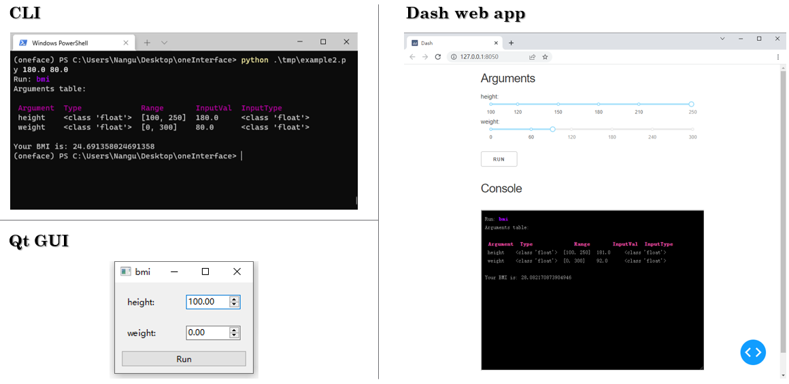

# oneFace

oneFace is a library for automatically generating multiple interfaces(CLI, GUI, WebGUI) from a callable Python object. (**WIP**)

<p>
    <a href="https://github.com/Nanguage/oneFace/actions/workflows/build_and_test.yml">
        
    </a>
    <a href="https://app.codecov.io/gh/Nanguage/oneFace">
        
    </a>
</p>


```Python
from oneface import one, Arg

@one
def bmi(height: Arg(float, [100, 250]),
        weight: Arg(float, [0, 300])):
    BMI = weight / (height / 100) ** 2
    print(f"Your BMI is: {BMI}")

# run cli
bmi.cli()
# or run qt_gui
bmi.qt_gui()
# or run dash web app
bmi.dash_app()
```

