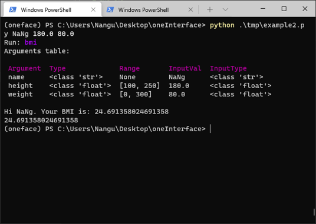
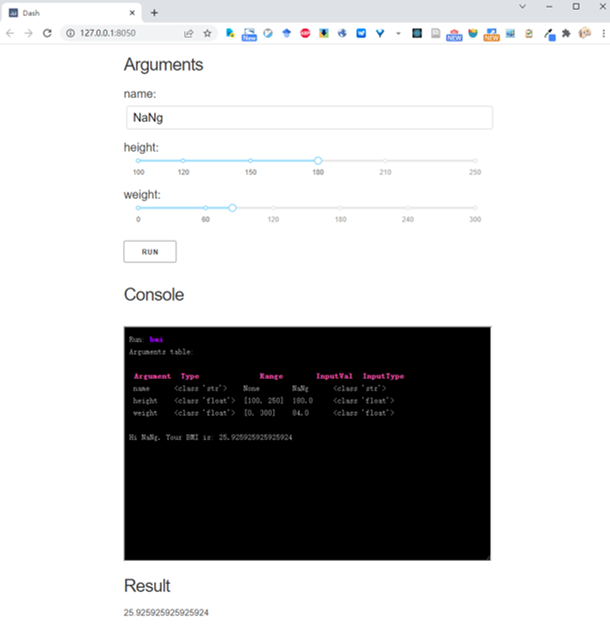

<div align="center">


<p> oneFace is a Python library for automatically generating multiple interfaces(CLI, GUI, WebGUI) from a callable Python object. </p>

<p>
    <a href="https://github.com/Nanguage/oneFace/actions/workflows/build_and_test.yml">
        
    </a>
    <a href="https://app.codecov.io/gh/Nanguage/oneFace">
        
    </a>
    <a href="https://oneface.readthedocs.io/en/latest/">
    	
    </a>
  <a href="https://pypi.org/project/oneFace/">
    
  </a>
</p>

</div>


oneFace is an easy way to create interfaces in Python, just decorate your function and mark the type and range of the arguments:

```Python
from oneface import one, Arg

@one
def bmi(name: Arg(str),
        height: Arg(float, [100, 250]) = 160,
        weight: Arg(float, [0, 300]) = 50.0):
    BMI = weight / (height / 100) ** 2
    print(f"Hi {name}. Your BMI is: {BMI}")
    return BMI


# run cli
bmi.cli()
# or run qt_gui
bmi.qt_gui()
# or run dash web app
bmi.dash_app()
```

These code will generate the following interfaces:

|  CLI | Qt | Dash |
| ---- | -- | ---- |
|  |  |  |

## Features

+ Generate CLI, Qt GUI, Dash Web app from a python function.
+ Automatically check the type and range of input parameters and pretty print them.
+ Easy extension of parameter types and GUI widgets.

Detail usage see the [documentation](https://oneface.readthedocs.io/en/latest/).

## Installation

To install oneFace with complete dependency:

```
$ pip install oneface[all]
```

Or install with just qt or dash dependency:

```
$ pip install oneface[qt]  # qt
$ pip install oneface[dash]  # dash
```
