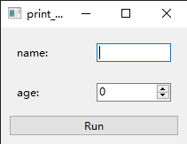
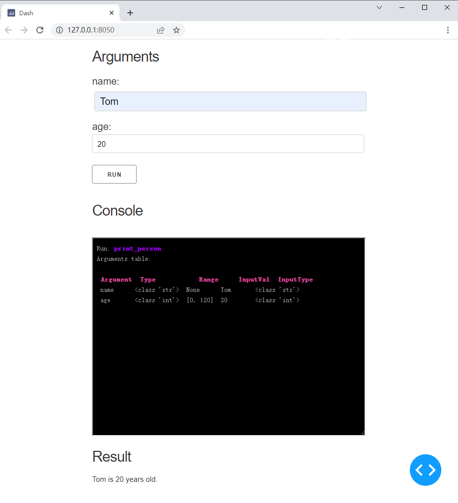

# Basic Usage

Using `one` decorate the function, and use `Arg` mark type and range of the arguments.

```Python
from oneface import one, Arg

@one
def print_person(name: str, age: Arg[int, [0, 120]]):
    return f"{name} is {age} years old."
```

**Note**: `Arg(type, range)` is same to `Arg[type, range]`.

```Python
# This is same to the previous defination
@one
def print_person(name: str, age: Arg(int, [0, 120])):
    return f"{name} is {age} years old."
```

## Type and range checking

Functions decorated with `one` will automatically check the type and range of input parameters:

```Python
>>> print_person("Tom", 20)
Run: print_person
Arguments table:

 Argument  Type           Range     InputVal  InputType
 name      <class 'str'>  None      Tom       <class 'str'>
 age       <class 'int'>  [0, 120]  20        <class 'int'>

'Tom is 20 years old.'
```

If we pass parameters with incorrect type or range, it will raise an exception:

```Python
>>> print_person(100, -20)  # incorrect input type and range
Run: print_person
Arguments table:

 Argument  Type           Range     InputVal  InputType
 name      <class 'str'>  None      100       <class 'int'>
 age       <class 'int'>  [0, 120]  -20       <class 'int'>

Traceback (most recent call last):
  File "<stdin>", line 1, in <module>
  File "C:\Users\Nangu\Desktop\oneInterface\oneface\core.py", line 117, in __call__
    raise ArgsCheckError(errors)
oneface.core.ArgsCheckError: [TypeError("Input value 100 is not in valid type(<class 'str'>)"), ValueError('Input value -20 is not in a valid range.')]
```

### Turn-off arguments print

By default, oneface will pretty print the input arguments with a table. It can be turned off with the `print_args` parameter:

```Python
@one(print_args=False)
def print_person(name: str, age: Arg[int, [0, 120]]):
    return f"{name} is {age} years old."

>>> print_person("Tom", 20)
'Tom is 20 years old.'
```

## Create interfaces

Create a python module `print_person.py`:

```Python
from oneface import one, Arg

@one
def print_person(name: str, age: Arg[int, [0, 120]]):
    return f"{name} is {age} years old."

print_person.cli()
```

This will create a Command Line Interface for `print_person` function. You can call this function in the Shell:

```Bash
$ python print_person.py Tom 20
Run: print_person
Arguments table:

 Argument  Type           Range     InputVal  InputType
 name      <class 'str'>  None      Tom       <class 'str'>
 age       <class 'int'>  [0, 120]  20        <class 'int'>

Tom is 20 years old.
```

If you want change to another interface, just change the `.cli()` to `.qt_gui()` or `.dash_app()`.
Then run this file again:

```
$ python print_person.py
```

You will got the Qt gui:



Or Dash web app:

