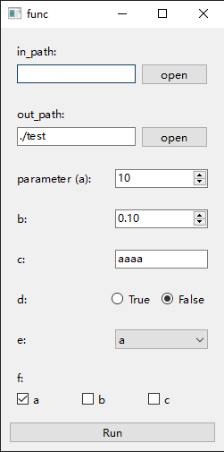
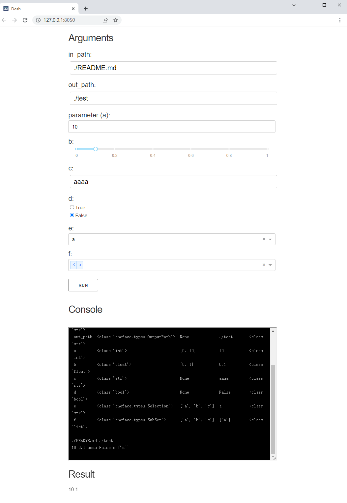

# Built-in argument types

oneFace support the following types:

| Type | Example | Type check | Range check | Description |
| ---- | ------- | ---------- | ----------- | ----------- |
| str  | `Arg(str)` | `True` | `False` | String input. |
| int | `Arg(int, [0, 10])` | `True` | `True` | Int input. |
| float | `Arg(float, [0, 1])` | `True` | `True` | Float input. |
| bool | `Arg(bool)` | `True` | `False` | Bool input. | 
| Selection | `Arg(Selection, ["a", "b", "c"])` | `False` | `True` | Input should be a element of the range. |
| SubSet | `Arg(SubSet, ["a", "b", "c"])` | `False` | `True` | Input should be a subset of the range. |
| InputPath | `Arg(InputPath)` | `True` | `True` | Input should be an exist file path(`str` or `pathlib.Path`). |
| OutPath | `Arg(OutputPath)` | `True` | `False` | Input should be a file path(`str` or `pathlib.Path`) |

This example show all built-in types, name as `builtin_example.py`:

```Python
from oneface.core import one, Arg
from oneface.types import (Selection, SubSet, InputPath, OutputPath)

@one
def func(in_path: InputPath,
         out_path: OutputPath = "./test",
         a: Arg[int, [0, 10], text="parameter (a)"] = 10,
         b: Arg[float, [0, 1]] = 0.1,
         c: Arg[str] = "aaaa",
         d: Arg[bool] = False,
         e: Arg[Selection, ["a", "b", "c"]] = "a",
         f: Arg[SubSet, ["a", "b", "c"]] = ["a"]):
    print(in_path, out_path)
    print(a, b, c, d, e, f)
    return a + b


func.qt_gui()
```

Running the script will get:



Change the last line to `func.dash_app()` and run it again, you will get:


