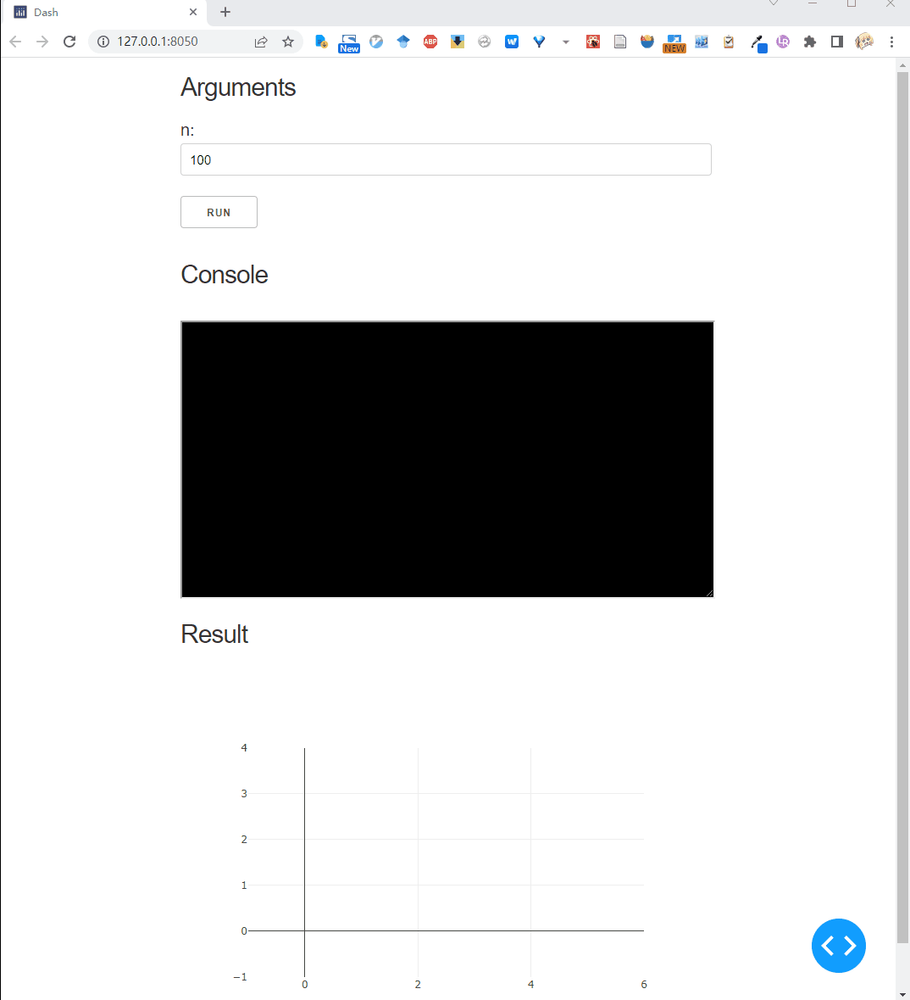

# Customization dash app generation

You can custom the dash app layout by inherit the `oneface.dash_app.App` class.
For example we can create a app draw a random series:

```Python
# random_series.py
from oneface.dash_app import App
from oneface import Arg, one
import numpy as np
import plotly.express as px
from dash import Dash, Output, Input, dcc


class PlotSeries(App):
    def __init__(self, func, **kwargs):
        super().__init__(func, **kwargs)

    def get_result_layout(self):
        # override the result layout definition
        layout = self.base_result_layout()
        layout += [
            dcc.Graph(id='line-plot')
        ]
        return layout

    def add_result_callbacks(self, app: "Dash"):
        # override the result callback definition
        @app.callback(
            Output("line-plot", "figure"),
            Input("out", "data"),
        )
        def plot(val):
            fig = px.line(val)
            return fig


@one
def random_series(n: Arg[int, [0, 10000]] = 100):
    return np.random.random(n) * 100


p = PlotSeries(random_series, debug=True)
p()
```

Run this script, we get:


