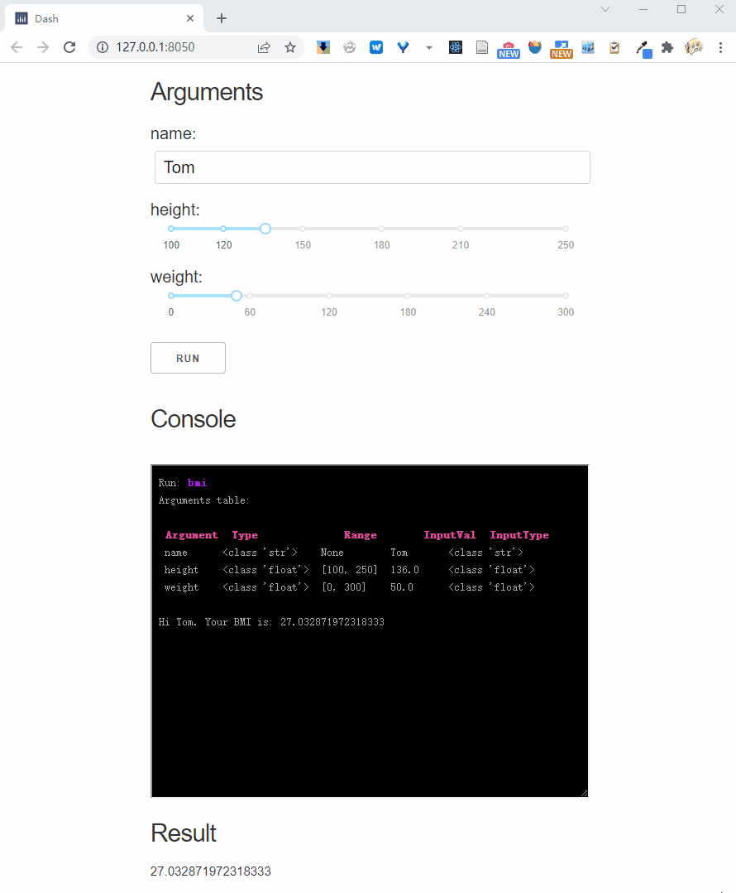
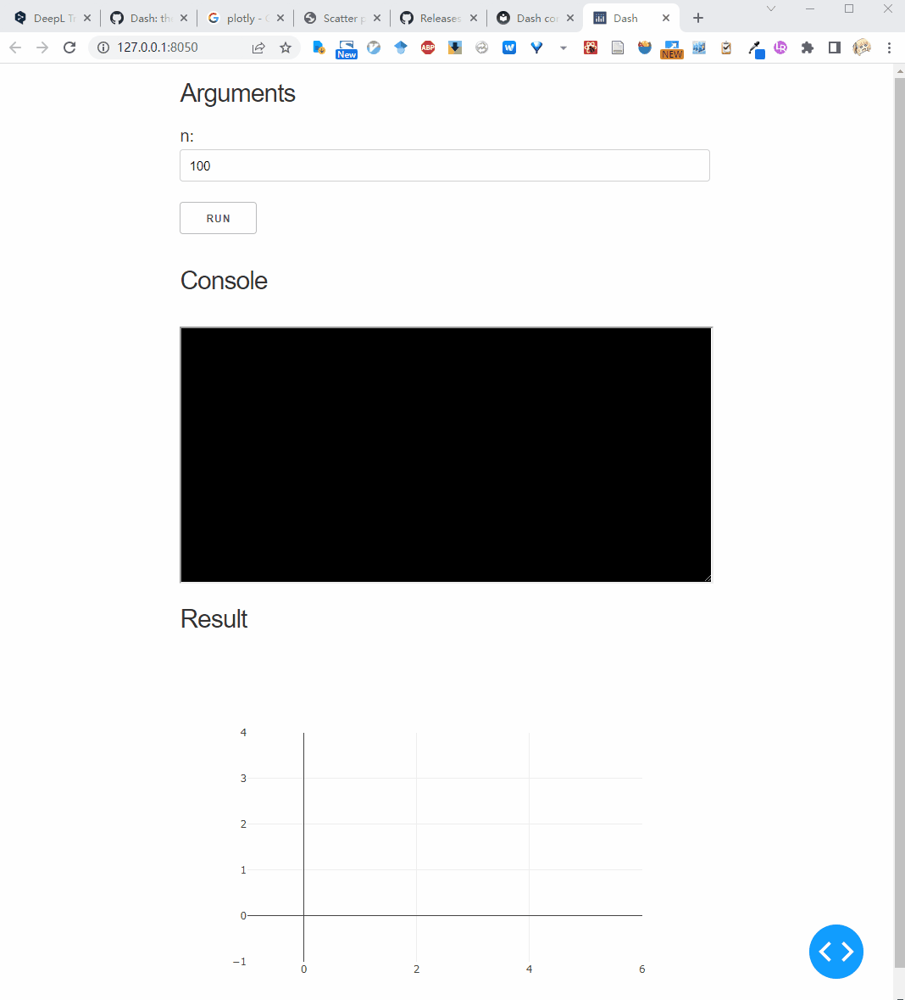
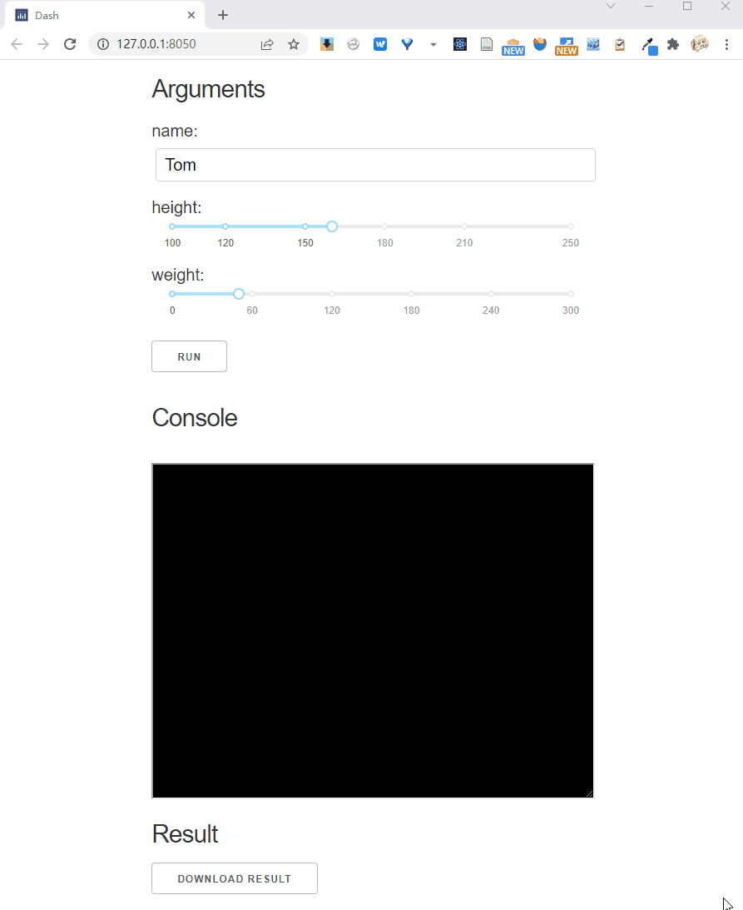
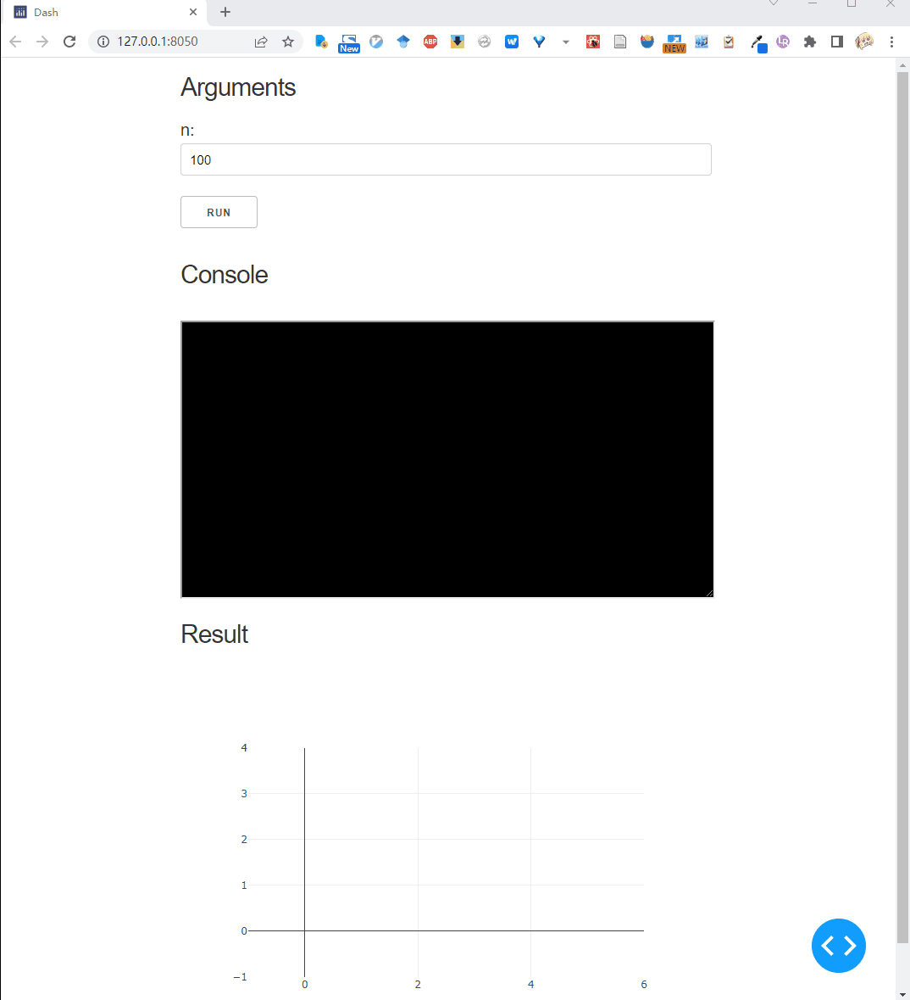

# Dash interface configs

## Hidden console

oneface dash provides a terminal for displaying operational status.
The `show_console` parameter is used to control whether it is displayed.

```Python
from oneface import one, Val

@one
def bmi(name: str = "Tom",
        height: Val[float, [100, 250]] = 160,
        weight: Val[float, [0, 300]] = 50.0):
    BMI = weight / (height / 100) ** 2
    print(f"Hi {name}. Your BMI is: {BMI}")
    return BMI

bmi.dash_app(show_console=False)
```

Will not show the console.

## Console refresh interval

By default, the console is refreshed in 2 seconds (2000 microseconds).
`console_interval` can be used to set the refresh interval

```Python
bmi.dash_app(console_interval=1000)
```

Will set refresh interval to 1 second.

## Argument label

By default, argument label is the variable name. But it can be explicitly set by `text` parameter:

```Python
@one
def bmi(name: Val(str, text="NAME"),  # explicitly label setting
        height: Val(float, [100, 250]) = 160,
        weight: Val(float, [0, 300]) = 50.0):
    BMI = weight / (height / 100) ** 2
    print(f"Hi {name}. Your BMI is: {BMI}")
    return BMI
```

## Init run

By default, it is not called until the user clicks the run button.
However, the initial call can be turned on by setting `init_run=True`:

```Python
bmi.dash_app(init_run=True)
```

This will cause the `bmi` function to be called once automatically at the end of app initialization.
In this case, all parameters need to have default values.

## Interactive parameter

Interactive parameters rerun the function each time the input is changed.
We can use `Val`'s parameter to mark the interactive mode, for example we mark `height` as interactive:

```Python
@one
def bmi(name: Val(str) = "Tom",
        height: Val(float, [100, 250], interactive=True) = 160,
        weight: Val(float, [0, 300]) = 50.0):
    BMI = weight / (height / 100) ** 2
    print(f"Hi {name}. Your BMI is: {BMI}")
    return BMI
```



And, if you pass `interactive = True` to the `.dash_app` method, it will mark all parameters as interactive:

```Python
bmi.dash_app(interactive=True)
```

## Result show type

By default, the `result_show_type` is `'text'`, which means that the result will be displayed in text.
In addition, the results can also be presented in other forms:


### Plotly figure type

Dash app can integrate the plotly to drawing dynamic figures in HTML.
By setting `result_show_type` to `'plotly'` and wrap a function return the plotly figure object,
we can archieve this:

```Python
from oneface import one, Val
import plotly.express as px
import numpy as np

@one
def draw_random_points(n: Val[int, [1, 10000]] = 100):
    x, y = np.random.random(n), np.random.random(n)
    fig = px.scatter(x=x, y=y)
    return fig

draw_random_points.dash_app(
    result_show_type='plotly',
    debug=True)
```



### Download type

In many cases, the results of running a web application need to be downloaded as a file for the user.
You can set the `result_show_type='download'` for this purpose.
In this case, the target function should return the path to the result file:

```Python
from oneface import one, Val

@one
def bmi(name: Val(str) = "Tom",
        height: Val(float, [100, 250], interactive=True) = 160,
        weight: Val(float, [0, 300]) = 50.0):
    BMI = weight / (height / 100) ** 2
    out_path = f"./{name}_bmi.txt"
    with open(out_path, 'w') as fo:
        fo.write(f"Hi {name}. Your BMI is: {BMI}")
    return out_path

bmi.dash_app(result_show_type="download")
```




### Custom result type

You can custom the dash app layout by inherit the `oneface.dash_app.App` class.
For example we can create a app draw a random series:

```Python
# random_series.py
from oneface.dash_app import App
from oneface import Val, one
import numpy as np
import plotly.express as px
from dash import Dash, Output, Input, dcc


class PlotSeries(App):
    def __init__(self, func, **kwargs):
        super().__init__(func, **kwargs)

    def get_result_layout(self):
        # override the result layout definition
        layout = self.base_result_layout()
        layout += [
            dcc.Graph(id='line-plot')
        ]
        return layout

    def add_result_callbacks(self, app: "Dash"):
        # override the result callback definition
        @app.callback(
            Output("line-plot", "figure"),
            Input("out", "data"),
        )
        def plot(val):
            fig = px.line(val)
            return fig

@one
def random_series(n: Val[int, [0, 10000]] = 100):
    return np.random.random(n) * 100


p = PlotSeries(random_series, debug=True)
p()
```

Run this script, we get:



## Host and Port

Specify the app's host and port:

```Python
bmi.dash_app(host="0.0.0.0", port=9000)
```

## debug mode

The debug mode is useful for debugging errors, use `debug=True` to open it:

```Python
bmi.dash_app(debug=True)
```
