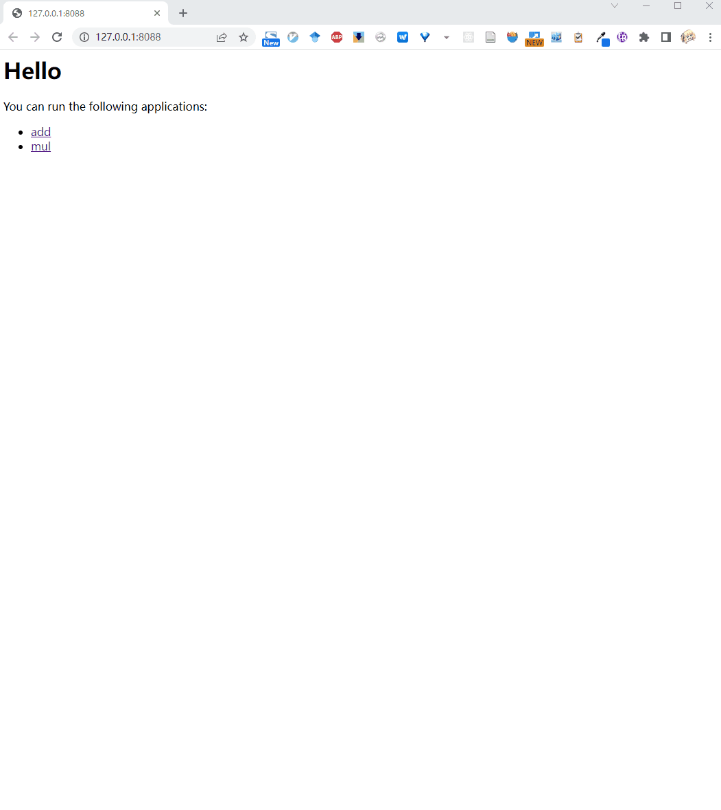

# Embeding dash to Flask web app

You can embed the oneFace generated dash app in a Flask application
to integrate a number of dash apps when needed,
or to leverage the power of Flask for additional functionality.

Here is an example where we have integrated the `add` and `mul` applications into a single Flask server:

```Python
# demo_flask_integrate.py
from flask import Flask, url_for
from oneface.dash_app import flask_route
from oneface.core import one
from oneface.dash_app import app

server = Flask("test_dash_app")

@flask_route(server, "/add")
@one
def add(a: int, b: int) -> int:
    return a + b

@flask_route(server, "/mul")
@app(console_interval=500)
@one
def mul(a: int, b: int) -> int:
    return a * b

@server.route("/")
def index():
    return f"""
    <h1>Hello</h1>

    <div>
        <p>You can run the following applications:</p>
        <div>
        <ul>
            <li><a href="{url_for("add")}">add</a></li>
            <li><a href="{url_for("mul")}">mul</a></li>
        </ul>
        </div>
    </div>
    """

server.run("127.0.0.1", 8088)
```



