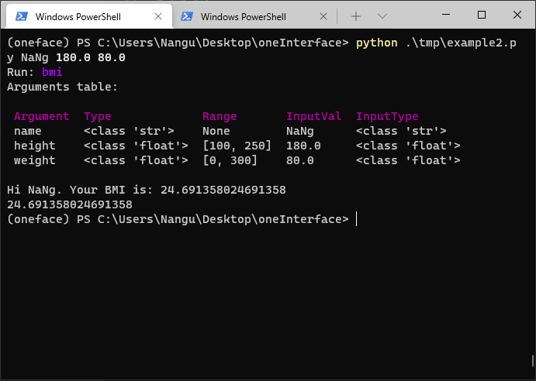
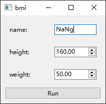
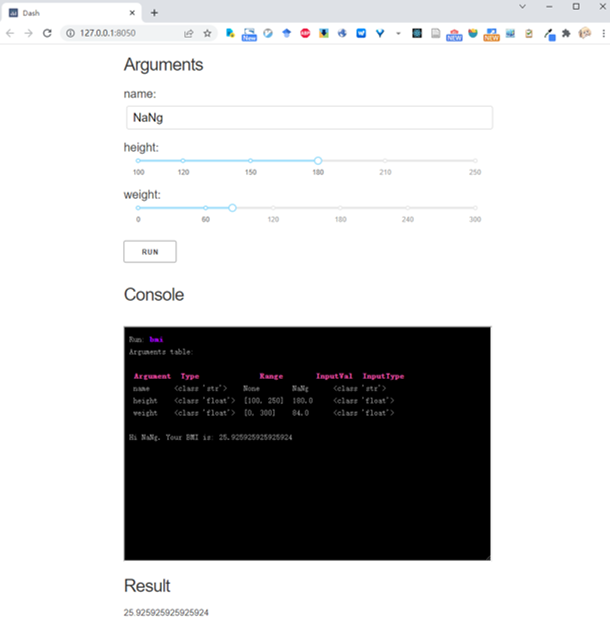

oneFace is a Python library for automatically generating multiple interfaces(CLI, GUI, WebGUI) from a callable Python object.

## Features

+ Generate CLI, Qt GUI, Dash Web app from a python function.
+ Automatically check the type and range of input parameters and pretty print them.
+ Easy extension of parameter types and GUI widgets.

## Installation

To install oneFace with complete dependency:

```
$ pip install "oneface[all]"
```

Or install with just qt or dash dependency:

```
$ pip install "oneface[qt]"  # qt
$ pip install "oneface[dash]"  # dash
```

### Qt bindings

oneFace support different Qt bindings: PyQt6(default), PyQt5, PySide2, PySide6. It can be specified: 

```
$ pip install "oneface[pyside2]"  # for example
```

## Example

oneFace is an easy way to create interfaces in Python,
just decorate your function and mark the **type** and **range** of the arguments:

```Python
from oneface import one, Arg

@one
def bmi(name: str,
        height: Arg[float, [100, 250]] = 160,
        weight: Arg[float, [0, 300]] = 50.0):
    BMI = weight / (height / 100) ** 2
    print(f"Hi {name}. Your BMI is: {BMI}")
    return BMI


# run cli
bmi.cli()
# or run qt_gui
bmi.qt_gui()
# or run dash web app
bmi.dash_app()
```

These code will generate the following interfaces:

|  CLI | Qt | Dash |
| ---- | -- | ---- |
|  |  |  |

