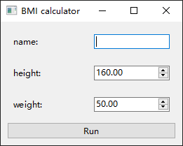
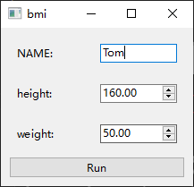
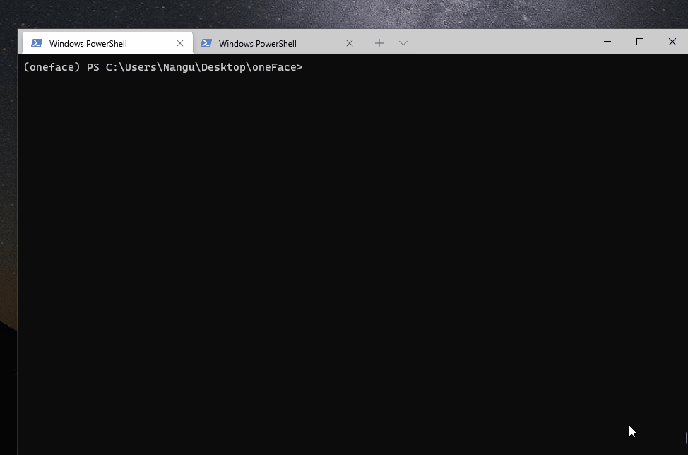

# Qt interface configs

## Window name

By default the window name is the name of the function, but it can be changed by `name` parameter of `.qt_gui` method:

```Python
from oneface import one, Arg

@one
def bmi(name: str,
        height: Arg[float, [100, 250]] = 160,
        weight: Arg[float, [0, 300]] = 50.0):
    BMI = weight / (height / 100) ** 2
    print(f"Hi {name}. Your BMI is: {BMI}")
    return BMI

bmi.qt_gui(name="BMI calculator")
```



## Argument label

By default, argument label is the variable name. But it can be explicitly set by `text` parameter:

```Python
@one
def bmi(name: Arg(str, text="NAME"),  # explicitly label setting
        height: Arg[float, [100, 250]] = 160,
        weight: Arg[float, [0, 300]] = 50.0):
    BMI = weight / (height / 100) ** 2
    print(f"Hi {name}. Your BMI is: {BMI}")
    return BMI
```


## Run multiple times

By default, oneface Qt interface run only once then exit, when click the run button.


You can use the `run_once=False` to make it run multiple times:

```Python
bmi.qt_gui(run_once=False)
```



## Window size

The `size` parameter is used to explicitly specify the window size:

```Python
bmi.qt_gui(size=(400, 600))  # width and height
```
