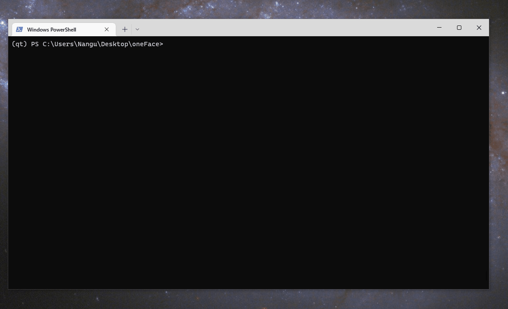

# Embeding generated window to a PyQt app

You can integrate oneFace generated Qt windows by embedding them in a Qt application:

```Python
# demo_qt_embed.py
import sys
from oneface.qt import gui
from oneface import one
from qtpy import QtWidgets

app = QtWidgets.QApplication([])


@gui
@one
def add(a: int, b: int):
    res = a + b
    print(res)

@gui
@one
def mul(a: int, b: int):
    res = a * b
    print(res)


main_window = QtWidgets.QWidget()
main_window.setWindowTitle("MyApp")
main_window.setFixedSize(200, 100)
layout = QtWidgets.QVBoxLayout(main_window)
layout.addWidget(QtWidgets.QLabel("Apps:"))
btn_open_add = QtWidgets.QPushButton("add")
btn_open_mul = QtWidgets.QPushButton("mul")
btn_open_add.clicked.connect(add.window.show)
btn_open_mul.clicked.connect(mul.window.show)
layout.addWidget(btn_open_add)
layout.addWidget(btn_open_mul)
main_window.show()

sys.exit(app.exec())
```

Run it:


