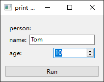
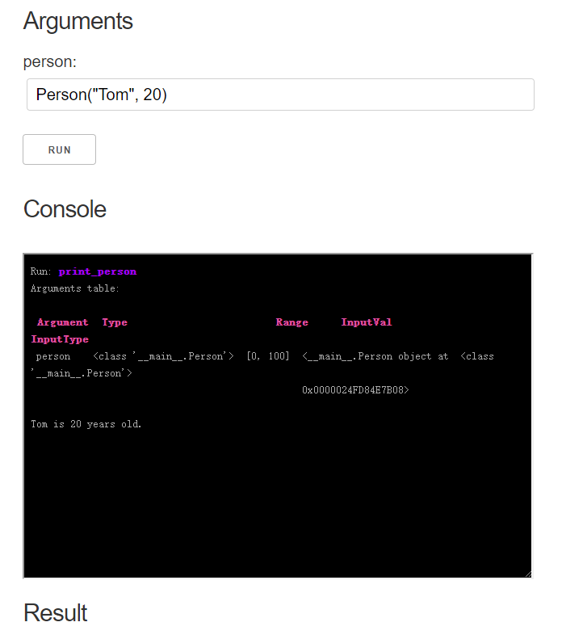
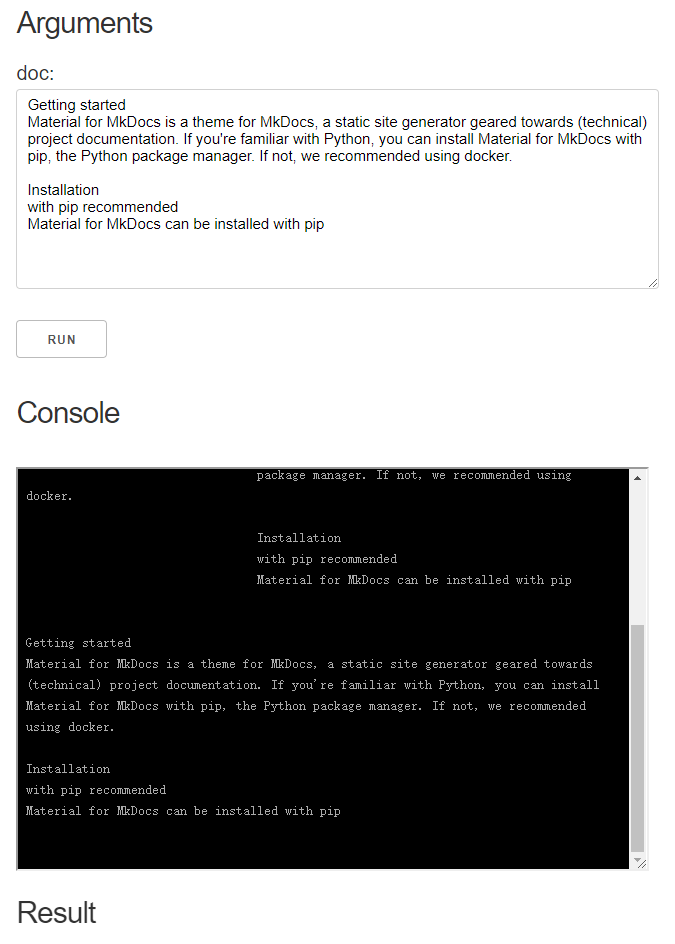

# Type Extension

You can easily extend the argument types in oneFace.

## Registration of type and range check

For example you have a custom `Person` class:

```Python
class Person:
    def __init__(self, name, age):
        self.name = name
        self.age = age
```

### Register type check

```Python
Arg.register_type_check(Person)
```

This will allow oneface to check the type of the input parameter to make sure it is an instance of `Person`:

```Python
@one
def print_person(person: Person):
    print(f"{person.name} is {person.age} years old.")

>>> print_person(["Tom", 10])  # Incorrect input type
Run: print_person
Arguments table:

 Argument  Type                       Range  InputVal     InputType
 person    <class '__main__.Person'>  None   ['Tom', 10]  <class 'list'>

Traceback (most recent call last):
  File "<stdin>", line 1, in <module>
  File "C:\Users\Nangu\Desktop\oneFace\oneface\core.py", line 117, in __call__
    raise ArgsCheckError(errors)
oneface.core.ArgsCheckError: [TypeError("Input value ['Tom', 10] is not in valid type(<class '__main__.Person'>)")]
```

`Arg.register_type_check` also allow you to define a custom type checker, for example:

```Python
def check_person_type(val, tp):
    return (
        isinstance(val, tp) and
        isinstance(val.name, str) and
        isinstance(val.age, int)
    )

Arg.register_type_check(Person, check_person_type)
```

This will not only check if the input value is an instance of `Preson`, but also ensure that its attributes are of the correct type:

```Python
>>> print_person(Person("Tom", "10"))  # Incorrect age type
Run: print_person
Arguments table:

 Argument  Type                       Range  InputVal                       InputType
 person    <class '__main__.Person'>  None   <__main__.Person object at     <class '__main__.Person'>
                                             0x000001FBEC3BBCC8>

Traceback (most recent call last):
  File "<stdin>", line 1, in <module>
  File "C:\Users\Nangu\Desktop\oneFace\oneface\core.py", line 117, in __call__
    raise ArgsCheckError(errors)
oneface.core.ArgsCheckError: [TypeError("Input value <__main__.Person object at 0x000001FBEC3BBCC8> is not in valid type(<class '__main__.Person'>)")]
```

### Register range check

You can also register a range check for it, for example, to limit the age to a certain range:

```Python
Arg.register_range_check(Person, lambda val, range: range[0] <= val.age <= range[1])
```

Mark the range in argument annotation:

```Python
@one
def print_person(person: Arg[Person, [0, 100]]):
    print(f"{person.name} is {person.age} years old.")
```

This will limit the person's age in the range of 0~100:

```Python
>>> print_person(Person("Tom", -10))
Run: print_person
Arguments table:

 Argument  Type                       Range     InputVal                    InputType
 person    <class '__main__.Person'>  [0, 100]  <__main__.Person object at  <class '__main__.Person'>
                                                0x000001FBEC3FC248>

Traceback (most recent call last):
  File "<stdin>", line 1, in <module>
  File "C:\Users\Nangu\Desktop\oneFace\oneface\core.py", line 117, in __call__
    raise ArgsCheckError(errors)
oneface.core.ArgsCheckError: [ValueError('Input value <__main__.Person object at 0x000001FBEC3FC248> is not in a valid range.')]
```

## Registration of interface widgets

If you want to generate the appropriate widget for your custom type, you should register it in the specific interface.

### Register widgets in Qt interface

```Python
from oneface.qt import GUI, InputItem
from qtpy import QtWidgets


class PersonInputItem(InputItem):
    def init_layout(self):
        self.layout = QtWidgets.QVBoxLayout()

    def init_ui(self):
        self.name_input = QtWidgets.QLineEdit()
        self.age_input = QtWidgets.QSpinBox()
        if self.range:
            self.age_input.setMinimum(self.range[0])
            self.age_input.setMaximum(self.range[1])
        if self.default:
            self.name_input.setText(self.default.name)
            self.age_input.setValue(self.default.age)
        self.layout.addWidget(QtWidgets.QLabel("person:"))
        name_row = QtWidgets.QHBoxLayout()
        name_row.addWidget(QtWidgets.QLabel("name:"))
        name_row.addWidget(self.name_input)
        self.layout.addLayout(name_row)
        age_row = QtWidgets.QHBoxLayout()
        age_row.addWidget(QtWidgets.QLabel("age:"))
        age_row.addWidget(self.age_input)
        self.layout.addLayout(age_row)

    def get_value(self):
        return Person(self.name_input.text(), self.age_input.value())


GUI.register_widget(Person, PersonInputItem)
```




### Register widgets in Dash interface


```Python
from oneface.dash_app import App, InputItem
from dash import dcc

class PersonInputItem(InputItem):
    def get_input(self):
        if self.default:
            default_val = f"Person('{self.default.name}', {self.default.age})"
        else:
            default_val = ""
        return dcc.Input(
            placeholder="example: Person('age', 20)",
            type="text",
            value=default_val,
            style={
                "width": "100%",
                "height": "40px",
                "margin": "5px",
                "font-size": "20px",
            }
        )


App.register_widget(Person, PersonInputItem)
App.register_type_convert(Person, lambda s: eval(s))
```

!!! warning

    Currently, there is no good way to composite dash components. Here, for simplicity, we use the serialized input Person. The above code is not recommended for use in production environments. see [issue#1](https://github.com/Nanguage/oneFace/issues/1)



#### Another example: TextArea

Here we give another example of using TextArea to get long string input.

```
from oneface import one, Arg
from oneface.dash_app import App, InputItem
from dash import dcc


class LongStrInputItem(InputItem):
    def get_input(self):
        return dcc.Textarea(
        placeholder='Enter a value...',
        value=(self.default or ""),
        style={'width': '100%'}
    )


App.register_widget(str, LongStrInputItem)


@one
def print_doc(doc: Arg(str)):
    print(doc)


print_doc.dash_app()
```



More details on the dash component definition can be found in the [dash documentation](https://dash.plotly.com/dash-core-components).
